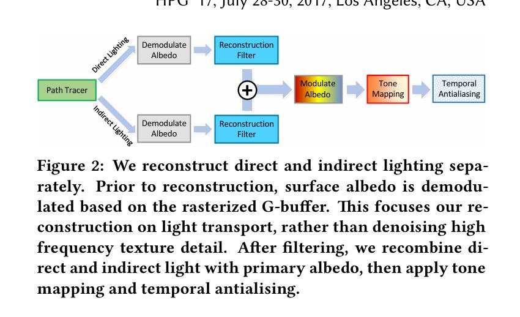
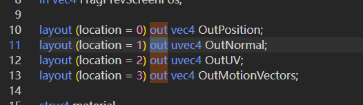
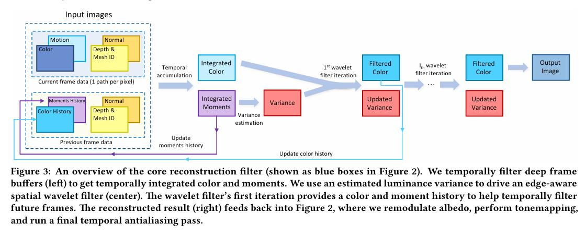

# SVGF

## Reconstruction Pipline

### Path Tracing

作为重建算法的输入，我们使用标准路径追踪和下一事件估计来生成 1spp 颜色样本。 我们的路径追踪器进行了优化，以更好地利用 GPU 可用资源，包括使用光栅化器有效地生成主光线。 它提供了一个无噪声的 G-buffer[Saito and Takahashi 1990]，其中包含用于引导我们的重建算法的附加表面属性（见第 4 节）。

使用低差异哈尔顿序列（Halton and Smith 1964）对光源和扫描方向进行采样。 我们循环使用一小组 Halton 样本（例如 16 个），因为我们的时间 "指数移动平均值 "会在几帧之后失去较早样本的贡献。 对于在路径的第一次扫描事件之后的非使用表面，我们采用路径空间正则化方法[Kaplanyan 和 Dachsbacher 2013]。 正则化本质上是在二次扫描事件中增加表面粗糙度，使路径追踪器能够通过与光源连接，找到间接反弹的贡献，即使是高光泽材料也不例外。 这增加了光传输的稳健性，并使路径的贡献更加均匀。 我们还将路径长度限制为每条路径只有一个额外的扫描事件，从而限制了计算成本。 因此，我们只需追踪一条光线，即可找到间接可见的表面，再加上两条阴影光线，即可将主要和次要命中点与光源连接起来。

我们的路径追踪器分别输出直接光照和间接光照。 这样，滤波器就能独立考虑两个部分的局部光滑度，并能更好地重建采样不佳的阴影边缘。 分离似乎会使成本增加一倍，但由于许多步骤使用的是光栅化的 G-buffer ，因此大量工作是可以分担的。

### Reconstruction

### Post Processing
